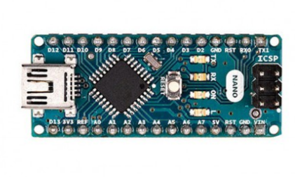

# Alat Dan Bahan
- Project Board
berguna untuk menghubungkan komponen menjadi suatu rangkaian tertentu tanpa proses penyolderan

- Arduino Nano
berfungsi sebagai pengontrol rangkaian elektronik yang tersambung pada project board

- Komponen Elektronika
Komponen yang umum digunakan untuk pemula :

- LED
- Push Button
- Potensiometer
- Jumper
- Resistor 10k ohm

