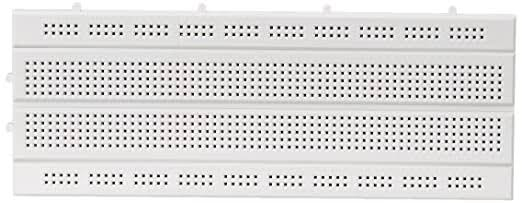
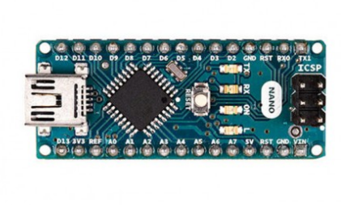
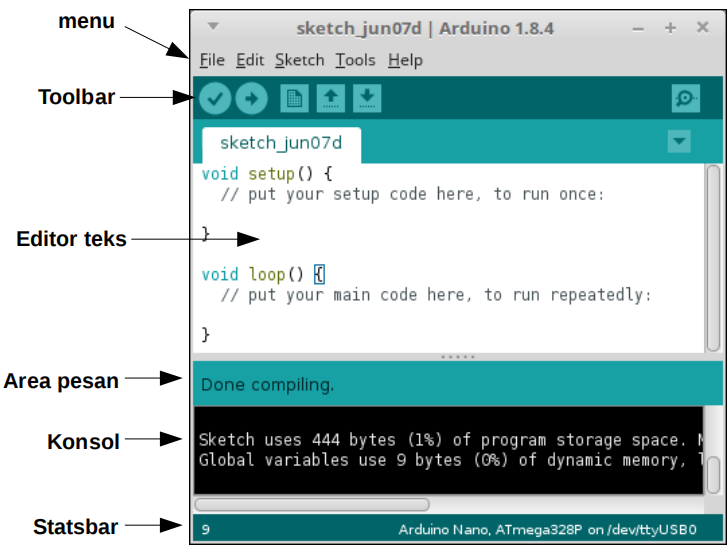

## Alat Dan Bahan ##
**Project Board**

berguna untuk menghubungkan komponen menjadi suatu rangkaian tertentu tanpa proses penyolderan

**Arduino Nano**

berfungsi sebagai pengontrol rangkaian elektronik yang tersambung pada project board

**Komponen Elektronika**

Komponen yang umum digunakan untuk pemula :

- LED
- Push Button
- Potensiometer
- Jumper
- Resistor

## Arduino IDE ##
Aplikasi Arduino IDE adalah aplikasi pengembangan terpadu khusus
untuk perangkat berbasis arduino. Tampilan Arduino IDE adalah sebagai berikut

program yang ditulis menggunakan arduino IDE dinamakan *sketches* ini ditulis dalam editor teks dan disimpan dalam file dengan akhiran *.ino*

anda bisa mendownload aplikasi tersebut di [https://arduino.cc/](https://arduino.cc/software/)
